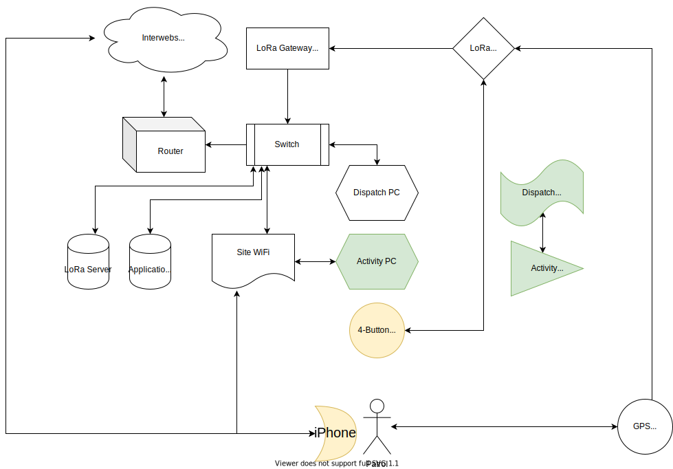

# Backstory

Earth is being invaded by an alien race from an alternate reality.

Something about these aliens liking [Octaoxygen](https://en.wikipedia.org/wiki/Octaoxygen), which, if you look at the [molecular structure](https://upload.wikimedia.org/wikipedia/commons/thumb/e/e9/Octaoxygen-from-xtal-3D-balls.png/170px-Octaoxygen-from-xtal-3D-balls.png), looks suspiciously like the [VicJam logo](https://static.wixstatic.com/media/03c781_2f5a12acf0354813906a5bacf4b4d839~mv2.png/v1/fill/w_201,h_271,al_c,q_85,usm_0.66_1.00_0.01/03c781_2f5a12acf0354813906a5bacf4b4d839~mv2.webp)

Octaoxygen: 

VicJam logo: 

In order to prevent this alien invasion, we need to something something complete challenges and solve puzzles to find clues etc.

This, is your mission.

# Game process

From a logistical perspective, the game is quite simple.

* We have a collection of Scout Patrols
* We have a collection of Bases
* Each Base has a radio
* Each Base has an activity to be completed. There are 3 types of bases:
  * Crewed bases, with leaders facilitating an activity such as Laser Tag that the scouts participate in
  * Self-directed bases, where scouts are given an activity to perform independently
  * Data Reading bases, where scouts simply read some "intelligence" at that base that they need to report back to HQ
* In advance, we set up schedules for each patrol to dictate which bases they need to visit, and in which order

With all of the above set up, the process is:

1. We brief all patrols together about what they'll be doing, and tell each patrol which base they'll be going to first, providing them a map to guide them
2. We'll *probably* have GPS trackers to give each patrol so we can keep track of them
3. Each patrol will head off to their first base
4. Once patrols reach their base, they'll use the on-base radio to call us at HQ, and give us the "Intelligence" from that base. This Intelligence would have been gathered by either reading a poster or similar in the vicinity of the base, completing a puzzle or something, or performing an activity under supervision of a leader
5. If that patrol gives the correct intelligence, we tell them what their next base is, and they move on to it, and repeat step 4
6. If they don't give the correct intelligence, we give them a couple more chances to get it right before getting them to move on regardless to keep the game moving, and they repeat step 4
7. Eventually each patrol has completed their allocated bases and at their last base we tell them to return to HQ
8. We dismiss the patrols

# Infrastructure

To facilitate the above process, we have a web app to track where each patrol is, all the bases they're allocated to go to, etc. That app's code is in this Git repository.

# Network diagram

The network required to facilitate RadioActiv8 is as follows:

The green elements are required to be used by Scouts. The yellow elements were required to be used by Cub Scouts, but they're not participating anymore so those can be ignored.

# Hardware

The only hardware I think we're currently *missing* are LoRa GPS units, additional LoRA equipment (access points?), and perhaps a router.
